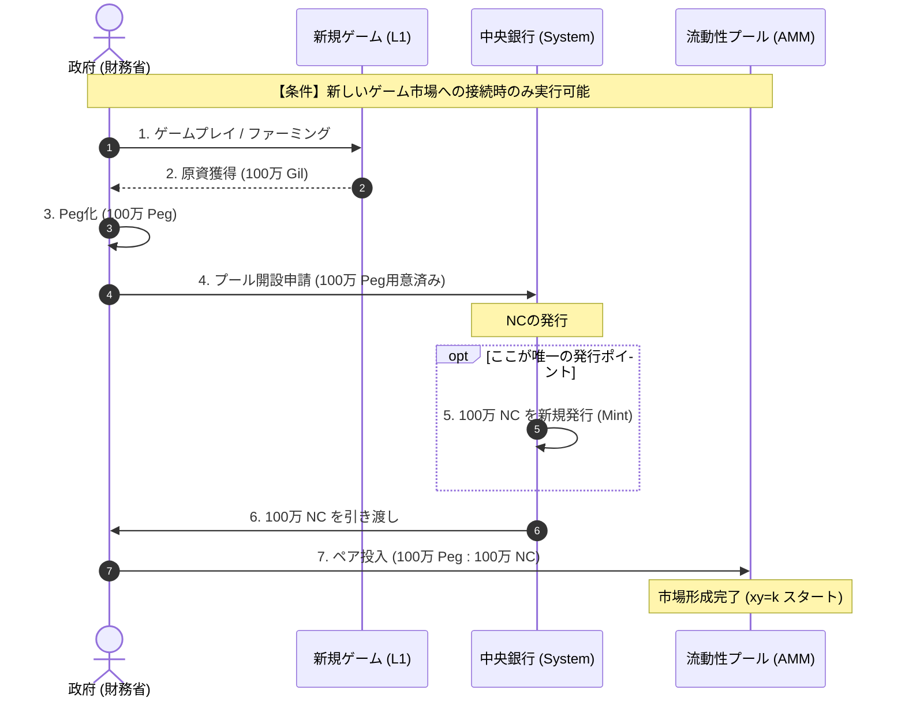
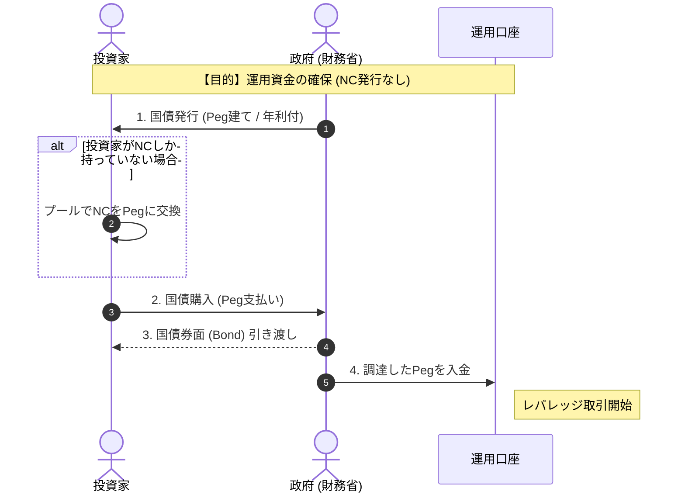
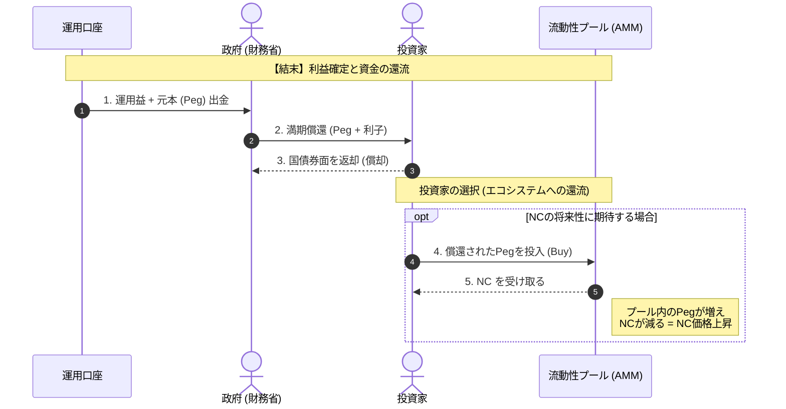

決定された**「市場連動型発行制度（Market-Backed Emission）」**に基づき、3つの主要なフェーズ（新規発行、資金調達、償還）における資金フローをMermaidで可視化しました。

---

### 1. 新規市場開拓と通貨発行（The Minting Phase）

これは**NC（自国通貨）が世界に生まれる唯一の瞬間**です。「政府が汗をかいて稼いだ外貨」と引き換えに、銀行がプール用のNCを発行します。

---

### 2. 国債発行による資金調達（The Funding Phase）

政府はNCを刷れないため、投資家から**「Peg（外貨）」**を借ります。中央銀行はこのプロセスに関与しません（規律の維持）。

---

### 3. 償還とエコシステムの循環（The Redemption Cycle）

運用益を使って借金を返し、その資金がまたプールに戻ってくることで、NCの価値（需要）が高まる仕組みです。

### この図解のポイント

1. **中央銀行の出番が少ない:** 図1（新規発行）にしか登場しません。これにより「政府が勝手に刷っていない」ことが視覚的にわかります。
2. **プールの役割:** 図3の最後にあるように、償還された資金が再びプールに戻ることで、**「国債運用が成功するほど、NCの価値（対Pegレート）が上がる」**という健全なサイクルが表現されています。
