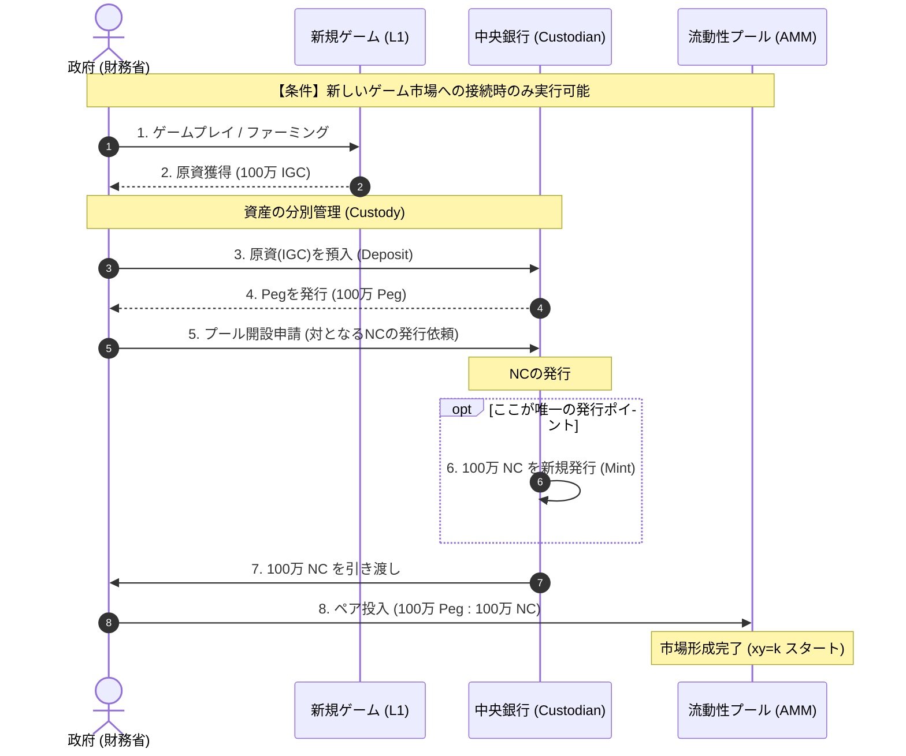
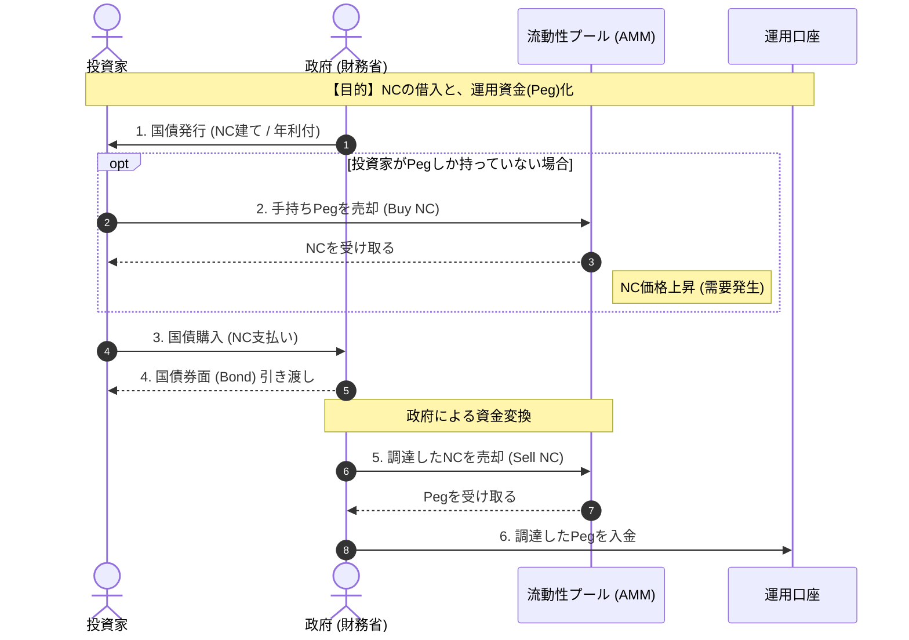
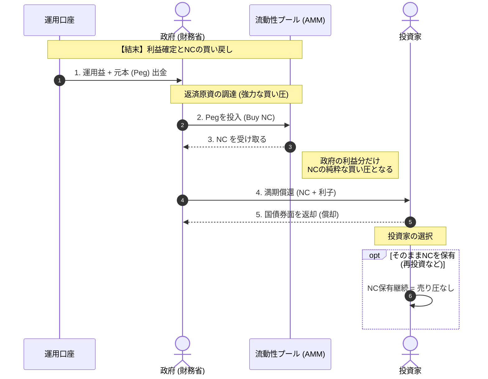

### 1. 新規市場開拓と通貨発行（The Minting Phase）

これは**NC（自国通貨）が世界に生まれる唯一の瞬間**です。政府が獲得したL1通貨（原資）を中央銀行の金庫に預け入れ、その裏付けとして発行されたPegと、銀行が新規発行したNCをセットにして市場を作ります。

---

### 2. 国債発行による資金調達（The Funding Phase）

政府は**「NC建て」**で借金をします。投資家はNCを用意する必要があり、政府は借りたNCを運用資金（Peg）に換えます。

---

### 3. 償還とエコシステムの循環（The Redemption Cycle）

運用益（Peg）を使って、市場から**NCを買い戻し（Buyback）**、投資家に返済します。この「買い戻し」がNCの価値を支えます。

