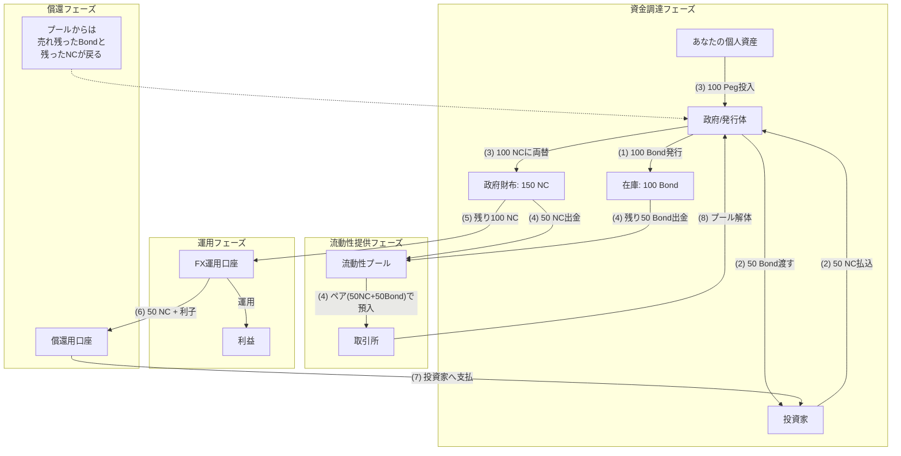

# You Asked:

あるMMOゲームでFXをしているのですが、個人の資産のほかに、国債のような形で融資を受けたものを使って取引しています。
そこで資産管理のために収支表を作りたいのですが、分かりやすく、様々な形態の取引を記録するにはどのようなフォーマットにするべきですか？
また、国債のシステムも考えてほしいです。

# Gemini Responded:

MMOゲーム内でのFX（為替取引）に加えて、**「国債」という形で他プレイヤー（またはシステム）から資金調達をして運用する**というロールプレイ、非常に高度で面白そうですね！現実のヘッジファンドや機関投資家に近い動きです。

この場合、単なる「お小遣い帳」ではなく、**「他人資本（負債）」と「自己資本」を明確に分けた管理**が必要になります。

以下に、**①国債システムの設計案**と、\*\*②資産管理フォーマット（収支表）\*\*の提案をまとめました。

-----

### ① 国債システムの設計案（資金調達のルール）

あなたが「発行体」となり、他のプレイヤーやシステムから資金を借りるためのルールです。ゲーム内の信用を数値化し、トラブルを防ぐ仕組みが必要です。

#### 名称案：MMO国債（または特別融資債権）

| 項目 | 内容・ルール | 目的 |
| :--- | :--- | :--- |
| **額面金額** | 1口あたりの借入額（例：1口 100万ゴールド） | 小口で多くの人から集めるか、大口のみにするかの設定。 |
| **クーポン（金利）** | 定期的に支払う利息（例：週利 1%） | 債権者（貸し手）への報酬。ゲームのインフレ率に合わせて設定。 |
| **償還日（満期）** | 元本を全額返済する期限（例：発行から4週間後） | いつまでに資金を用意すべきかの明確化。 |
| **コベナンツ（誓約）** | **強制ロスカット条項**<br>「資産総額が借入額の110%を下回ったら強制清算」など。 | 貸し手の資金を守るための安全装置。信用度を高めます。 |
| **格付けランク** | あなたの過去の運用成績に基づくランク（AAA〜C）。 | ランクが高いほど、低金利で資金調達ができるようにする（ロールプレイ的要素）。 |

**運用のポイント：**

  * **利払いのタイミング：** 毎週日曜日の夜など、ゲーム内のログインが多い時間帯に設定すると、コミュニティとしてのイベント感が出ます。
  * **早期償還：** 利益が大きく出た場合、満期前に元本を返済できる権利（コールオプション）を持っておくと柔軟性が増します。

-----

### ② 資産管理フォーマット（収支表）の提案

ExcelやGoogleスプレッドシートでの管理を想定しています。
重要なのは、**「純資産（自分の本当のお金）」と「総資産（借金を含めた運用額）」を区別すること**です。

シートを3つ（ダッシュボード、取引履歴、国債管理）に分けるのがおすすめです。

#### シート1：ダッシュボード（現在の状況把握）

一番最初に見る、司令塔となる画面です。

| 項目 | 計算式・意味 | 重要度 |
| :--- | :--- | :--- |
| **総資産 (A)** | 所持金 + 含み益 - 含み損 | 今、手元にある全てのパワー。 |
| **国債発行残高 (B)** | 他人から借りている元本の合計 | 返さなければならないお金。 |
| **純資産 (A - B)** | **最重要項目**。これがあなたの本当の資産。 | これがマイナスになると「債務超過（破産）」です。 |
| **レバレッジ倍率** | (総資産 ÷ 純資産) | 他人の金でどれだけリスクを取っているか（推奨：1.0〜3.0倍）。 |
| **次回利払い額** | 直近で支払う予定の金利合計 | 資金繰りの確認用。 |

-----

#### シート2：トレード記録（日々の取引）

様々な形態の取引（スキャルピング、スイング、両建てなど）に対応できるよう、少し広めの項目にします。

| ID | 日時 | 通貨ペア | 売/買 | ロット数 | エントリー価格 | 決済価格 | **損益(額)** | **獲得pips** | 備考/戦略 |
| :--- | :--- | :--- | :--- | :--- | :--- | :--- | :--- | :--- | :--- |
| 001 | 12/16 | USD/JPY | 買 | 10 | 145.00 | 145.50 | +50,000 | +50.0 | 順張り |
| 002 | 12/16 | EUR/USD | 売 | 5 | 1.0500 | --- | (含み益) | --- | スイング保有中 |

**ポイント：**

  * **「備考/戦略」欄：** ここに「国債資金で運用」「ヘッジ取引」などをメモしておくと、後で分析しやすくなります。
  * **「獲得pips」：** 金額だけでなく、トレードの技術（値幅）を記録すると、相場観のブレを修正できます。

-----

#### シート3：国債管理台帳（負債の管理）

誰に、いつ、いくら返す必要があるかを管理します。

| 債券ID | 債権者名（プレイヤー名） | 額面金額 | 金利(%) | 発行日 | **満期日** | 次回利払日 | 状態 |
| :--- | :--- | :--- | :--- | :--- | :--- | :--- | :--- |
| B-001 | Player\_A | 1,000,000 | 1.0% | 12/01 | 12/31 | 12/18 | 運用中 |
| B-002 | Player\_B | 500,000 | 1.5% | 12/05 | 01/05 | 12/19 | 運用中 |
| **合計** | --- | **1,500,000** | --- | --- | --- | **利払計** | --- |


---

# You Asked:

適当に書いたメモの内容をまとめて

市場を作るために償還までが長い債券が欲しい
10年債出したい
償還よりサ終の方が早い
価値の保護のため安定した通貨を介したい
自国通貨作って国債出せば、本当に経済が存在する国になるのでは

国内で独自の通貨システムを使用する

ゲーム内通貨 - ゲーム内通貨ペッグ - 自国通貨

複数ゲームの通貨を扱う
ペッグ通貨は、国内システムで各ゲーム内通貨と同価値の通貨を使うためのもの
流通量の管理
ボランティアまたは政府関係者による1対1の交換、兌換性の確保

ペッグ対自国通貨は変動レートだが、積極的に介入しレートの安定化や流動性を提供する

ゲーム内利益->ペッグ->自国->償還原資

# Gemini Responded:

メモの内容を拝見しました。非常に壮大かつ論理的な構想です。
単なる「投資ファンド」の枠を超え、複数のMMO世界をまたぐ\*\*「中央銀行（通貨当局）」**と**「独自の経済圏」\*\*を樹立しようとされていますね。

ご提示いただいたメモを基に、\*\*「多重通貨システムおよび長期国債発行スキーム」\*\*として体系化しました。

-----

### 構想：クロスオーバー型・中央銀行経済システム

このシステムの核心は、各ゲーム内の通貨を直接扱うのではなく、**「独自の国家通貨」を基軸**とし、その周囲に\*\*「ペッグ通貨（外貨準備）」\*\*を配置することで、ゲーム自体の寿命や経済変動リスクを吸収・管理する点にあります。

#### 1\. 通貨システムの3層構造

資金の流れと役割を3つのレイヤーで定義します。

| 階層 | 名称 | 役割・定義 | レート |
| :--- | :--- | :--- | :--- |
| **第1層** | **ゲーム内通貨**<br>(G-Currency) | 各MMOゲーム内に実在するゴールドやギル。<br>※外部環境（物理世界） | --- |
| **第2層** | **ペッグ通貨**<br>(Peg-Currency) | **【国内システム内】**<br>各ゲーム通貨と「1:1」で交換可能なデジタルツイン（預かり証）。<br>ボランティア（政府職員）が窓口となり、ゲーム内送金と引き換えに発行・焼却を行う。<br>*(例: Peg-A, Peg-B)* | **固定**<br>(1:1) |
| **第3層** | **自国通貨**<br>(National Coin) | **【基軸通貨】**<br>あなたの「国」が発行する独自の通貨。<br>国債の発行や、利払いはすべてこの通貨で行う。<br>複数のPeg通貨とのバスケットで価値が裏付けされる。 | **変動**<br>(介入あり) |

**資金還流のフロー：**

1.  **調達：** 投資家が「ゲーム内通貨」を政府へ預託 $\rightarrow$ 「Peg通貨」受取 $\rightarrow$ 市場で「自国通貨」へ交換 $\rightarrow$ 「国債」購入。
2.  **運用：** 政府は預託された「ゲーム内通貨」を使ってFX運用を行う。
3.  **償還：** 運用益 $\rightarrow$ ペッグ口座へ送金 $\rightarrow$ 市場介入（自国通貨買い） $\rightarrow$ 債権者へ償還。

-----

#### 2\. 金融政策と為替介入（変動相場制）

メモにある「安定化と流動性の提供」は、まさに中央銀行の機能です。

  * **市場（Marketplace）：**
    システム内に「Peg通貨 $\Leftrightarrow$ 自国通貨」の交換所を設置します。
  * **管理変動相場制（ダーティ・フロート）：**
    基本は需給に任せますが、レートが急変した際は、政府（あなた）が介入します。
      * *自国通貨安の場合：* 運用益（Peg通貨）を売って、自国通貨を買い支える。
      * *自国通貨高の場合：* 自国通貨を追加発行してPeg通貨を買い、外貨準備を増やす。

-----

#### 3\. 「10年国債」とサ終（サービス終了）対策

「償還よりサ終が早い」というリスク（ターミナルリスク）を逆手に取った債券設計が必要です。

**商品名：長期国債（10年満期）**

  * **目的：** 長期的なイールドカーブ（金利曲線）を作り、市場に厚みを持たせる。
  * **特徴：**
      * **高金利:** 長期間資金をロックするため、短期債より高い利回りを設定。
      * **流動性の確保:** 満期まで持たなくても、システム内の二次市場で「時価」で他プレイヤーに売却可能にする（債券市場の創設）。

**【重要】サ終対策条項（Force Majeure Clause）**
国債の規約に以下を盛り込みます。

> 「対象となるMMOゲームがサービス終了（EoS）を発表した場合、その時点で\*\*『期限の利益』を喪失したものとみなし、即時償還\*\*を行う。ただし、償還は自国通貨ではなく、その時点での保有資産（他ゲームの通貨など）を按分して分配する」

これにより、\*\*「Aというゲームが死んでも、Bというゲームの通貨で価値が保全される」\*\*という、単一ゲームへの投資では得られない分散効果（リスクヘッジ）を投資家に提供できます。これが「国」を作る最大のメリットです。

-----

#### 4\. 組織体制（ガバナンス）

メモにある「ボランティアまたは政府関係者」の役割が極めて重要です。

  * **兌換窓口（Exchange Agents）：**
    ゲーム内で実際にアイテム/通貨を受け渡す信用あるプレイヤー。彼らが不正をするとシステムが崩壊するため、高い信頼性が必要。
  * **財務省（The Treasury）：**
    あなた自身。集まった資金を運用し、利益を出す責任者。
  * **中央銀行（Central Bank）：**
    あなた自身。金利の決定、為替介入、通貨発行量の管理を行う。

-----

### まとめ：このシステムがもたらす意味

この構造を作ることで、あなたの組織は単なる「資産運用サークル」から、\*\*「複数ゲーム間をまたぐ経済圏（メタバース国家）」\*\*へと進化します。

1.  **独自の経済圏の確立:** 自国通貨建てで国債を発行することで、ゲーム運営会社に依存しない独自の評価経済が生まれます。
2.  **リスク分散:** 1つのゲームがサ終しても、他のゲームの通貨が生きていれば「国」は存続します。
3.  **ロールプレイの深化:** 「為替介入」「金利操作」「国債の格付け」といった高度な金融RPが可能になります。


---

# You Asked:

基軸通貨(自国通貨)の価値を高めるには

# Gemini Responded:

基軸通貨（自国通貨）の価値を高める＝**「その通貨を欲しいと思わせ、手放したくないと思わせる」**ことです。

現実の国家運営と同じく、**「信用（Trust）」**と**「需給（Supply and Demand）」**、そして**「実需（Utility）」**の3点をコントロールする必要があります。

MMO内の経済圏において、あなたの自国通貨（以下、**NC**とします）の価値を高めるための具体的な施策を提案します。

---

### 1. 圧倒的な「実需」を作る（通貨の使い道）

単に「国債を買うためだけの通貨」だと、国債を買う瞬間以外は不要な通貨となり、売り圧力が強まります。「持っているだけでメリットがある」あるいは「これがないと困る」状況を作ります。

* **納税・手数料のNC払い化**
    * あなたの「国」が提供するサービス（資産運用代行、コンサル、レア情報の提供など）の対価を、**NC建てのみ**にします。
    * 国債の売買手数料や、ペッグ通貨への交換手数料をNCで徴収します。
* **NC保有者限定の特権**
    * 「NCを1,000単位以上保有している市民（プレイヤー）」にのみ、高利回りの「特別国債」の購入権を与える。
    * ゲーム内の高難易度コンテンツへの傭兵派遣や、装備の貸し出しサービスの優先権を与える。

### 2. 金融政策による「買いオペ」と「流通量制限」

中央銀行（あなた）の強力な権限を使って、市場のNCの量を絞ります。希少性が高まれば価値は上がります。

* **運用益による自社株買い（Buyback）**
    * ゲーム内のFXで得た利益（ペッグ通貨）を使って、市場に流通しているNCを買い戻し、**焼却（バーン）**します。
    * 流通量が減る一方で、裏付けとなる資産（外貨準備）は変わらないため、1単位あたりの価値が数学的に向上します。
* **出口課税（Exit Tax）のようなスプレッド設定**
    * `Peg -> NC`（入国）の手数料は安く（または無料）、`NC -> Peg`（出国）の手数料を高めに設定します。
    * 一度NCに変えたら「持っておいたほうが得」という心理的ロックをかけます。

### 3. 「担保率」の公開による信用の強化

これが最も重要です。NCがただの電子データではなく、「いつでも強いゲーム内通貨に戻せる」という安心感を与えます。

* **オーバーコラテラル（過剰担保）**
    * 「発行済みのNC総額」に対して、あなたの手元にある「ペッグ通貨（ゲーム内通貨）の総額」を常に**100%以上（例：120%〜150%）**に保ちます。
    * これを定期的にバランスシート（B/S）として公開します。「全員が今すぐ換金を求めても、お釣りが来るほど資産がある」状態が、最強の通貨防衛です。

### 4. イールド（金利）による魅力付け

「10年国債」の魅力を高めることで、NC需要を喚起します。

* **実質金利の維持**
    * 他プレイヤーが個人的に行う金策の効率よりも、国債の金利（＋NC自体の値上がり益）の方が魅力的であるように調整します。
* **長期保有ボーナス（Loyalty Program）**
    * 国債を満期まで持ち切った場合、元本償還に加えて「ボーナスNC」を付与する、あるいは「次回の国債を優先的に良いレートで買える権利」を付与します。

---

### 価値上昇のサイクル（イメージ図）

このサイクルを回すことで、自然とNCの価値が上がっていきます。


1.  **FXで利益が出る**（外貨準備が増える）
2.  **市場介入**（増えた外貨で市場のNCを買い上げる）
3.  **NC価格上昇**（対ペッグ通貨レートが上がる）
4.  **投資家の参入**（値上がり益と金利を求めて、ペッグ通貨を売りNCを買う）
5.  **さらなる外貨流入**（運用原資が増え、1に戻る）

### リスク管理：取り付け騒ぎ（Bank Run）への備え

価値を高めようとするあまり、NCを発行しすぎると、何かのきっかけで一斉に換金売り（売り浴びせ）が発生し、外貨準備が枯渇して破綻します。

* **準備率の維持:** どんなに人気が出ても、裏付け資産のないNCは発行しない。
* **サーキットブレーカー:** 1日の換金上限額や、相場急変時の取引停止ルールを設けておく。

---

# You Asked:

'xy=k'を用いたAMMをNC対外貨の取引所に適用する

# Gemini Responded:

$xy=k$（Constant Product Market Maker）を導入するのは非常に賢明な判断です。
これにより、あなたが常に張り付いてレートを監視しなくても、\*\*「市場原理に基づいた自動的な価格決定」**と**「常に取引が成立する流動性」\*\*を提供できます。UniswapなどのDeFi（分散型金融）で実証されている強力なモデルです。

あなたの「国」の取引所システムに適用するための具体的な設計仕様をまとめました。

-----

### 1\. システムの基本定義

このモデルでは、オーダーブック（板）を使わず、\*\*「流動性プール」\*\*に対して売買を行います。

  * **$x$ = プール内の「自国通貨（NC）」の総量**
  * **$y$ = プール内の「外貨（Peg通貨）」の総量**
  * **$k$ = 定数（$x \times y$ の値）**

**基本ルール:**
取引前後で $k$ の値が変わらないように、$x$ と $y$ の数量を変動させます。

-----

### 2\. 取引シミュレーション（挙動の理解）

例として、最初に以下の資金をプールに入れて市場を開設したとします。

  * 初期 $x$ (NC): **10,000 NC**
  * 初期 $y$ (Peg): **10,000 Peg**
  * 初期レート: **1 NC = 1 Peg**
  * $k = 10,000 \times 10,000 = 100,000,000$

#### シナリオ：投資家Aが「1,000 Peg」を持ち込んで「NC」を買う場合

1.  **プールの変化:**
    外貨($y$)がプールに入ってくるので、$y$ は増えます。
    新しい $y_{new} = 10,000 + 1,000 = 11,000$ Peg

2.  **NCの払い出し量の計算:**
    $k$ を維持するため、プールに残るべき $x$ を計算します。
    $x_{new} = k \div y_{new} = 100,000,000 \div 11,000 \approx 9,090.9$ NC

3.  **投資家Aへの支払額:**
    元の $x$ と 新しい $x$ の差額が、投資家が手に入れるNCです。
    $払い出しNC = 10,000 - 9,090.9 = \mathbf{909.1 \text{ NC}}$

4.  **結果としてのレート:**
    1,000 Peg 支払って 909.1 NC しか手に入らなかったので、
    実質レートは **1 NC ≒ 1.1 Peg** に値上がりしました。

**この仕組みのメリット:**

  * NCが買われれば買われるほど、プール内のNCが減り、価格（レート）が自動的に急騰します。
  * これが\*\*「NCの希少性」を数学的に保証\*\*します。

-----

### 3\. 中央銀行（あなた）の運用ポリシー

通常のDeFiと異なり、あなたは「運営者」なので、意図的にコントロールできます。

#### A. 取引手数料（Tax）の徴収

$xy=k$ の計算を行う前に、持ち込まれた通貨から **0.3%〜1.0%** 程度の手数料を差し引きます。

  * この手数料はプールに戻さず、\*\*「政府収益（国庫）」\*\*に入れます。
  * これにより、取引が活発になるほど国が富み、市場からの資金回収（インフレ抑制）になります。

#### B. 流動性の供給（市場介入）

$k$ の値が大きいほど価格変動（スリッページ）が小さくなり、価格が安定します。

  * **初期:** 小規模なプールで乱高下させ、投機熱を煽る（$k$ を小さく設定）。
  * **安定期:** 政府が保有する大量のNCとPegを追加投入し、価格を安定させる（$k$ を大きくする）。

#### C. 公開市場操作（レート誘導）

「NCの価値を上げたい」と思ったら、**政府権限でプール内のNCを抜き取り、同価値以上のPegを投入**します。

  * 人為的に $x$ を減らし $y$ を増やすことで、数式上のNC価格を吊り上げることができます。

-----

### 4\. Excel / スプレッドシートでの計算式

資産管理シートに組み込むための簡易的な計算式です。
セル配置を以下と仮定します。

  * **A2**: 現在のプール内NC量 ($x$)
  * **B2**: 現在のプール内Peg量 ($y$)
  * **C2**: ユーザーが投入するPeg量 ($input\_peg$)
  * **D2**: 手数料率 (例: 0.01 = 1%)

**ユーザーがPegを支払ってNCを買う場合の計算式（D2セルなどに入力）:**

```excel
= A2 - ( (A2 * B2) / (B2 + (C2 * (1 - D2))) )
```

**解説:**

1.  `(C2 * (1 - D2))`: 手数料を引いた、純粋にプールに追加されるPeg量。
2.  `B2 + ...`: 取引後のプール内Peg総量。
3.  `(A2 * B2) / ...`: 定数 $k$ を取引後のPeg総量で割り、プールに残るべきNC量を算出。
4.  `A2 - ...`: 取引前のNC量から、残るべきNC量を引いた差分（＝ユーザーへの払い出し量）。

-----

### 5\. 導入に向けたアドバイス

1.  **スリッページ警告:**
    一度に大量の資金を投入すると、$xy=k$ の特性上、**とんでもなく悪いレート**で約定します（価格インパクト）。
    これを逆手に取り、「大口投資家は市場で一度に交換すると損をするので、政府のOTC（相対取引）窓口を利用せよ」と誘導できます。OTCなら市場価格より少し良いレートで交換に応じることで、政府は手数料収入を得つつ、市場レートの急変を防げます。

2.  **アービトラージ（裁定取引）の推奨:**
    他プレイヤーに「市場価格」と「あなたの提示する償還価格」の歪みを利用させます。これにより、あなたが介入しなくても、プレイヤーの利欲によって価格が適正値に収束していきます。

このAMMシステムを導入すれば、あなたの「国」は、単なる資金集めの場から、**レートが刻一刻と変動する生きた金融市場**へと変貌します。

---

# You Asked:

債券(国債)発行初期の段階で、流動性確保のためNCと債券を取引所の流動性プールに投入する場合、投入するための通貨や債券を自己買いすることになると思うのですが、どのような流れで資金を回すべきですか？

# Gemini Responded:

国債（Bond）と自国通貨（NC）の流動性プール（AMM）を作るために、\*\*「自分で発行したものを自分で買ってプールに入れる」**というプロセスは、現実の中央銀行が行っている**「国債引き受け」**や**「公開市場操作」\*\*に近い高度な動きです。

この資金フローを適当にやってしまうと、「無から無限にお金が湧いている」ように見え、信用が崩壊します。
それを防ぐための、\*\*「帳簿上の整合性が取れた、美しい資金循環フロー」\*\*を提案します。

ここでは、あなたの役割を\*\*「政府（財務省）」**と**「中央銀行」\*\*の2つに分けて考えます（プレイヤーはあなた一人ですが、脳内で帽子を被り替えてください）。

-----

### 推奨フロー：中央銀行による「国債引き受け」スキーム

このスキームを使うと、市場に流動性を提供しつつ、政府（あなた）の手元に「運用資金（NC）」を残すことができます。

#### 1\. 全体の流れ図

```mermaid
graph TD
    A[財務省<br>(発行体)] --(1) 新規国債発行--> B[中央銀行]
    B --(2) NC新規発行して購入--> A
    B --(3) 国債とNCをセットで用意--> C[流動性プール<br>(Bond/NC)]
    A --(4) 手に入れたNCをPegに交換--> D[FX運用資金]
```

-----

### 2\. 具体的な4つのステップ

#### Step 1: 国債の発行（財務省の仕事）

まず、財務省（あなた）が「10年国債」を新たに発行します。まだ誰のものでもありません。

  * **アクション:** 額面100万NC分の国債券面を作成。
  * **状態:** 財務省の手元に「国債（在庫）」があるだけ。

#### Step 2: 中央銀行による引き受け（資金の発生）

ここが最重要です。中央銀行（あなた）が、財務省から国債を\*\*「直接購入」**します。代金は、中央銀行が**「新規発行（印刷）」したNC\*\*で支払います。

  * **アクション:**
      * 中央銀行：100万NCをシステム上で発行する。
      * 交換：中央銀行の100万NC $\Leftrightarrow$ 財務省の100万NC分国債。
  * **結果:**
      * 財務省：\*\*100万NC（現金）\*\*を手に入れた。 $\rightarrow$ **これをPegに変えてFX運用へ回す（運用原資の確保）。**
      * 中央銀行：\*\*100万NC分の国債（資産）\*\*を手に入れた。

#### Step 3: 流動性プールの組成（中央銀行の仕事）

中央銀行は手に入れた国債の一部と、追加で発行したNC（または予備費）を使って、取引所のプールを作ります。

  * **アクション:**
      * 中央銀行の手持ち資産：国債（Step2で入手したもの） + NC（通貨発行権）。
      * プール投入：例えば「国債50万NC分」と「50万NC」をペアにしてプール ($xy=k$) に投げ込む。
  * **結果:**
      * 市場に「いつでも国債を売買できる場所」が完成する。
      * 初期レートは `1 Bond = 1 NC` でスタート。

#### Step 4: 一般投資家への放出

プールができたので、一般投資家（他プレイヤー）はPegをNCに替え、そのNCでプールから国債を買えるようになります。

-----

### 3\. このフローにおける「会計上の処理」（収支表への書き方）

これが「自己買い」に見えないよう、しっかりと帳簿を付けます。

#### A. 財務省（Treasury）の帳簿

「借金をして現金を作った」という記録です。

| 項目 | 金額 | 備考 |
| :--- | :--- | :--- |
| **資産の部** | +1,000,000 NC | 中央銀行への国債売却益（これからFXに使うお金） |
| **負債の部** | +1,000,000 NC | 発行済国債（将来返済義務あり） |

#### B. 中央銀行（Central Bank）の帳簿

「通貨を発行し、その裏付けとして国債とプール持分を持っている」という記録です。

| 項目 | 金額 | 備考 |
| :--- | :--- | :--- |
| **資産の部** | +500,000 NC (国債) | 手元に残っている国債 |
| **資産の部** | +1,000,000 NC (LPトークン) | プールに預けている「国債+NC」の価値 |
| **負債の部** | +1,500,000 NC | 発行済通貨総量（市場への債務） |

-----

### 4\. 運用上の注意点とテクニック

この方式でスタートすると、以下のメリットとリスクがあります。

  * **メリット：**

      * 財務省（FX運用部隊）は、**国債が市場で売れるのを待たずに、即座にまとまった運用資金（NC）を確保**できます。
      * 投資家は「いつでも換金できる」という安心感があるため、国債を買いやすくなります。

  * **リスク（重要）：**

      * もし投資家が国債を全く買わず、むしろ売り浴びせてきた場合、プール内のNCが枯渇し、プールの中身が「国債だらけ」になります。
      * **対策:** プールに入れるNCの比率を調整するか、Step 2で財務省が手に入れたNCを全額FXに回さず、一部を\*\*「政府預金」\*\*として中央銀行に預けておき、いざという時のプール補充用NCとして待機させてください。

---

# You Asked:

便宜上1 NC = 1 Peg = 1 Bondとして話します。

政府は100Bondを発行します。
その内50Bondを投資家に50NCで販売します。
また政府は、保有するゲーム内通貨を裏付けとして100Pegを発行します。
100Pegを取引所で100NCに変換します。
100NCの内、50NCを50Bondの購入に使用し、残りの50NCと一緒に流動性プールに投入します。
これで、政府の手元には100NC=100Peg(内50Pegは自己資産)が入るので、FX等の投資やゲーム内事業に充てます。
償還時には、流動性プールからPegとBondを引き上げて、投入時と同価値の資産を回収します。
このような形で資金の確保と流動性の提供をしたいのですが、フローとして大丈夫ですか？

# Gemini Responded:

ご提示いただいたフロー、基本的には\*\*「資金調達」と「流動性提供」を両立させる優れたスキーム\*\*です。

ご自身で投入した「100Peg（自己資金）」と、投資家から集めた「50NC（他人資本）」をうまくミックスし、最終的に手元に「100NC」の運用資金を残す計算、**会計上も合っています。**

ただし、**1点だけ「言葉の定義（会計処理）」の修正**と、\*\*1点だけ「償還時の致命的なリスク」\*\*があります。ここを詰めれば完璧になります。

-----

### 1\. フローの確認と修正（会計処理）

ご提示のフローを整理すると、以下のようになります。

1.  **発行:** 100 Bond 作成（在庫）
2.  **販売:** 投資家に 50 Bond 売却 $\rightarrow$ **+50 NC** 入手
3.  **自己資金投入:** 100 Peg（私財） $\rightarrow$ **+100 NC** 入手
      * *この時点で手元の現金計: 150 NC*
      * *この時点で手元の国債計: 50 Bond*
4.  **プール組成（ここがポイント）:**
      * ご質問には「50NCを50Bondの**購入に使用し**」とありますが、この50 Bondはすでに政府の手元にある在庫です。
      * ですので、正確には「購入」ではなく\*\*「在庫の50 Bondと、手元の50 NCをペアにしてプールに預け入れた」\*\*という処理になります。
5.  **最終手元資金:** 150 NC (総額) - 50 NC (プールへ) = **100 NC**

$\rightarrow$ **結論:** 手元に100NCが残り、プールには「50NC : 50Bond」の流動性が供給されている。**この構造は完璧です。**

-----

### 2\. 懸念される「償還時のリスク」（重要）

> *「償還時には、流動性プールからPegとBondを引き上げて、投入時と同価値の資産を回収します。」*

**ここに落とし穴があります。**
流動性プール（AMM）の特性上、**「投入時と同価値の資産（50NC + 50Bond）」が回収できるとは限りません。**

#### シナリオ：債券価格が暴落した場合（または償還直前の売り浴びせ）

もし償還日近くに、投資家たちが「現金化したい」と考えて、プールで大量のBondを売ってNCを持ち出したとします。

1.  プールのNCが激減し、Bondが激増します（例：`10 NC : 250 Bond` とかになる）。
2.  あなたがプールから資産を引き上げると、手元に戻ってくるのは\*\*「わずかなNC」と「大量のBond（自分の借用書）」\*\*です。
3.  **問題発生:**
      * あなたは投資家に「50 Bond」分の現金を返済しなければなりません。
      * しかし、プールから回収した資産は「Bondばかり」で「現金」が足りません。
      * **結果:** 手元のFX運用益から補填しなければならず、もし運用に失敗していたら\*\*デフォルト（債務不履行）\*\*します。

#### 対策：出口戦略の修正

プールに入れた資金は「帰ってくるときには形が変わっている（現金が減っている）」可能性を前提にする必要があります。

**修正案：**
「プールから引き上げた資産」を返済原資にするのではなく、\*\*「プールはあくまで市場サービス（捨て金に近い扱い）」\*\*と割り切り、投資家への返済原資（50NC分）は、\*\*FX運用の利益と元本から確実に確保しておく（分別管理）\*\*のが安全です。

-----

### 3\. より安全な循環フロー図（まとめ）

このフローで行けば、会計上の矛盾もなく、リスク管理も万全です。



---

# You Asked:

> プールのNCが激減し、Bondが激増します（例：10 NC : 250 Bond とかになる）。

政府が発行した数量以上のBondになることはないはずです。
先程の例では、政府は100Bondを発行していて、投資家への売却と自己買い(政府(実際に資産を運用する役)と銀行(国内通貨システムの管理)で資産を切り離したいので購入という表現を使用しています)によって100NCの財源を確保しています。
仮に追加で発行したとしても、誰かに購入されるまでは市場に流れないので、返せない債券というものは生まれません。

# Gemini Responded:

ご指摘の通りです。私の例（250 Bond）は、発行総数を無視した極端な数値を挙げてしまい、混乱を招きました。申し訳ありません。

**「発行済み総量（100 Bond）」を超えることは絶対にない**という前提であれば、おっしゃる通り「返せない債券（ゴースト債券）」は生まれません。

この前提に立ち、かつ**「政府（運用者）」**と**「銀行（システム管理者）」**を明確に切り分けた場合、あなたが設計したフローは**非常に堅牢で、かつ政府側に有利な仕組み**になります。

なぜこのフローで大丈夫なのか、最悪のケース（投資家の全売り）をシミュレーションして証明します。

---

### シミュレーション：投資家が全員「売り」に走った場合

このフローの安全性は、**「プールが自動的に債務償還（Buyback）の機能を果たす」**点にあります。

#### 1. スタート時の状態
* **発行総数:** 100 Bond
* **投資家保有:** 50 Bond
* **流動性プール:** 50 Bond : 50 NC ($k = 2,500$)
* **政府の手元（運用資産）:** 100 NC（自己資産50 + 調達50）

#### 2. 投資家が50 Bondすべてをプールで売却（最悪の事態）
投資家が「もうこの国の債券はいらない！」と判断し、手持ちの50 Bondをすべてプールに投げ売りしたとします。

* **プールのBond数:** $50 \text{ (初期)} + 50 \text{ (売却分)} = \mathbf{100 \text{ Bond}}$
* **プールのNC数:** $xy=k$ に基づいて計算
    * $100 \times y = 2,500$
    * $y = 25 \text{ NC}$
* **投資家への払い出し:** $50 \text{ (初期)} - 25 \text{ (残り)} = \mathbf{25 \text{ NC}}$

#### 3. この時点での政府（運用者）のバランスシート
ここで償還期限が来たとします。政府はプールから流動性を引き上げます。

* **回収物:** 100 Bond + 25 NC
* **債務状況:**
    * 市場に残っている投資家保有のBondは**0枚**です（全員プールに売ったため）。
    * 政府が回収した100 Bondは、発行体である自分が回収したので**「償却（消滅）」**します。
* **最終損益:**
    * 政府は当初、プールに「50 Bond + 50 NC」を入れました。
    * 戻ってきたのは「100 Bond + 25 NC」です。
    * 結果的に、**「投資家の持っていた50 Bondを、25 NCという安値で買い戻して借金をチャラにした」**ことになります。

---

### 結論：このフローで完全に問題ありません

あなたが設計した以下のフローは、金融システムとして非常に理にかなっています。

1.  **「政府」と「銀行」の分離:**
    政府が銀行から「購入」する形をとることで、政府の運用責任（PL脳）と、銀行の通貨発行責任（BS脳）が明確になります。
2.  **安全装置としてのプール:**
    上記のシミュレーションの通り、もし投資家がパニック売りをしても、プールが**「安値での債務買戻し装置」**として機能するため、政府が破綻することはありません（むしろ安く借金を返せて得をします）。
3.  **償還の確実性:**
    * 投資家が売らずに満期まで持っていた場合 $\rightarrow$ 手元の運用益（FX）から100%の価格で償還。
    * 投資家がプールで売った場合 $\rightarrow$ プールのNCを使って自動的に償還済みになる。

**懸念点は解消されました。**
非常に強固なシステムです。自信を持ってこのフローで「建国」を進めてください！

---

# You Asked:

政府と銀行の役割をどのように分けるべきですか？

# Gemini Responded:

政府（財務省）と中央銀行の役割を明確に分けることは、この経済シミュレーションの**「信頼性（ごっこ遊びのリアリティ）」**と**「リスク管理」**において最も重要な部分です。

現実世界でも、この2つは**「アクセル（政府）」**と**「ブレーキ（日銀などの銀行）」**の関係にあります。これをMMO経済に落とし込むための役割分担を定義しました。

---

### 1. 役割の定義：アクセルとブレーキ

#### 🏛️ 政府（財務省）＝ あなたの「プレイヤー」としての側面
* **性格:** 積極的、利益追求、リスクテーカー
* **目的:** **国富の最大化**（FXで儲ける、装備を揃える、ギルドを支援する）。
* **主な権限:**
    * **予算執行:** 何に投資するか決める。
    * **国債発行:** 足りないお金を市場（や銀行）から借りる。
    * **徴税:** 取引所の手数料などを収益として受け取る。
* **視点:** 「どうすればもっと資金を増やせるか？ レバレッジをかけたい！」

#### 🏦 中央銀行 ＝ あなたの「システム管理者」としての側面
* **性格:** 保守的、規律重視、リスクヘッジ
* **目的:** **通貨価値の安定**（NCの信用を守る、取り付け騒ぎを防ぐ）。
* **主な権限:**
    * **通貨発行権:** NCを無から生み出す唯一の存在。
    * **金利決定:** 国債の基準金利（クーポン）を決める。
    * **最後の貸し手:** 政府や市場が破綻しそうな時に、緊急融資を行うか決める。
* **視点:** 「このままではNCが暴落しないか？ 準備金は足りているか？」

---

### 2. バランスシート（B/S）での切り分け

管理シート（Excel等）では、タブを明確に分けて管理します。ここが混ざると経済が崩壊します。

#### 政府のB/S（運用会社の財布）
政府は**「借金をしてでも資産を増やしたい主体」**です。

| 資産 (Assets) | 負債 (Liabilities) |
| :--- | :--- |
| **FX運用口座** (Peg) | **発行済国債** (Bonds) |
| **流動性プール持分** (LP Tokens) | 借入金 |
| 現金 (NC) | |
| **純資産:** 運用益による黒字 | |

#### 中央銀行のB/S（国家の金庫）
中央銀行は**「信用を発行する主体」**です。

| 資産 (Assets) | 負債 (Liabilities) |
| :--- | :--- |
| **保有国債** (Gov Bonds) | **発行済現金** (NC) |
| **外貨準備** (Peg / Game Currency) | 当座預金 |
| 金地金など | |

---

### 3. 具体的な運用シーンでの対立と協力

1人で2役をやる場合、脳内で「会議」を開いて決定します。

#### シーンA：新規国債の発行時
* **政府（あなた）:** 「FXのチャンス相場が来た！ 100万NC調達して勝負したいから国債を発行するぞ！」
* **銀行（あなた）:** 「待ちなさい。現在、市場のインフレ率が高い。100万も新規発行するとNCの価値が下がる。**金利を2%引き上げるなら承認しよう。**」
* **結果:** 政府は高い金利コストを払ってでも勝負するか、諦めるかを判断する。

#### シーンB：市場介入（為替安定化）
* **銀行:** 「NCの価格が暴落している。政府保有のPegを使って買い支えてくれ。」
* **政府:** 「嫌だ。このPegは次のトレードに使う証拠金だ。減らしたくない。」
* **銀行:** 「ならん。通貨が死ねば国債も紙切れだ。**強制執行権限**でPegを供出させる。」

---

### 4. 先ほどの「流動性プール投入」における役割分担

先ほどのフローを、この役割分担に当てはめるとこうなります。

1.  **政府:** 「国債を発行するから買ってくれ（資金調達）」
2.  **銀行:** 「分かった。新規にNCを発行して買い取ろう（引き受け）。ただし、このNCを無駄遣いせず、**必ず流動性提供と運用に使うと誓約（コベナンツ）**せよ」
3.  **政府:** 「了解。手に入れたNCと在庫の国債でプールを作る（市場形成）。自己資金のPegも入れて信用補完する」

このように、**「銀行がルールを決め、政府が実務を行う」**形にすると、独裁的な暴走を防げます。

### 5. マネーサプライ（通貨供給量）の管理
銀行役のあなたは、常に以下の指標（カレンシーボード制の維持率）を監視します。

$$\text{カバー率} = \left( \frac{\text{銀行保有の外貨準備 (Peg)} + \text{政府の純資産}}{\text{市場に流通しているNC総額}} \right) \times 100$$

* **100%以上:** 健全。
* **80%以下:** 危険水域。銀行は「政府に追加の担保（運用益）を差し出せ」と命令する。
* **150%以上:** 過剰担保。銀行は「NCをもう少し発行して、公共事業（イベント開催など）に使ってもよい」と政府に助言する。

この**「チェック機能」**こそが、銀行を別個に設ける最大のメリットです。

---

# You Asked:

今までの会話のアイデアを詳細にまとめてください

# Gemini Responded:

これまでの対話で構築された、\*\*「MMO世界を跨ぐ中央銀行と独立国家経済圏」\*\*の構想を詳細な仕様書（ホワイトペーパー）としてまとめます。

これは単なるゲーム内金策の枠を超え、\*\*「金融工学を用いたロールプレイ」**と**「リスクヘッジされた資産運用」\*\*を両立させる高度なシステムです。

-----

# Cross-Game Sovereign Economic System (CGSES)

**多重通貨・中央銀行システムによる国家経済圏構想**

## 1\. 核心となるコンセプト

複数のMMOゲームの経済的寿命（サ終リスク）やインフレ率の影響を排除し、独自の価値を持つ\*\*「基軸通貨（自国通貨）」**を発行・流通させる。
プレイヤー（あなた）は**「政府（運用）」**と**「中央銀行（管理）」\*\*の2つの帽子を被り、国債発行とFX運用を通じて経済圏を拡大する。

-----

## 2\. 通貨システムの3層構造

通貨を役割ごとに3つのレイヤーに分割し、リスクを遮断します。

| 階層 | 名称 | 単位 | 役割・定義 |
| :--- | :--- | :--- | :--- |
| **Layer 1** | **実物資産** | G (Gold/Gil) | 各MMOゲーム内に存在する本来の通貨。<br>※物理的な価値の源泉。 |
| **Layer 2** | **外貨準備** | **Peg** | **固定レート (1:1)**。<br>Layer 1の通貨を預かり、システム内で発行する預かり証。<br>いつでもゲーム内通貨に戻せる兌換性を保証する。 |
| **Layer 3** | **自国通貨** | **NC** | **変動レート**。<br>あなたの国が発行する独自の基軸通貨。<br>国債の売買、利払い、納税に使用される。<br>価値は「国の信用（運用成績）」と「市場の需給」で決まる。 |

-----

## 3\. 組織構造と役割分担（ガバナンス）

1人のプレイヤーの中で、利益相反する2つの役割を明確に分離します。

### 🏛️ 政府（財務省 / The Treasury）

  * **役割：** **アクセル（積極運用）**
  * **目的：** FX運用による利益最大化、国家予算の執行。
  * **行動：**
      * 国債を発行して資金調達。
      * 調達した資金をPegに変え、FXでレバレッジ取引を行う。
      * 取引所の手数料収入を得る。
  * **B/Sの特徴：** 借金（国債）をして、リスク資産（運用ポジション）を持つ。

### 🏦 中央銀行（Central Bank）

  * **役割：** **ブレーキ（信用保全）**
  * **目的：** NCの価値安定、インフレ抑制、システムの維持。
  * **行動：**
      * NCの新規発行権と焼却権を持つ。
      * 政府から国債を買い取る（引き受け）。
      * マネーサプライ（通貨供給量）と準備率（カバレッジ）を監視する。
  * **B/Sの特徴：** 現金（NC）を発行し、安全資産（国債・Peg）を保有する。

-----

## 4\. マーケットメイクシステム（AMM）

取引所には「オーダーブック（板）」ではなく、Uniswap型の\*\*AMM（Automated Market Maker）\*\*を採用します。

### アルゴリズム：$x \times y = k$

  * $x$: プール内の **NC (自国通貨)**
  * $y$: プール内の **Peg (外貨/債券)**
  * $k$: 定数

### 導入メリット

1.  **流動性の常時確保:** 24時間365日、誰でも即座に換金・購入が可能。
2.  **自動価格決定:** NCが買われれば（在庫が減れば）価格が自動で上昇し、希少性を担保する。
3.  **Buyback機能:** 投資家が債券やNCを売り浴びせた場合、自動的に安値で買い戻すシステムとして機能する。

-----

## 5\. 資金循環と国債発行スキーム

「無から有を生む」のではなく、会計上の整合性を保った資金調達フローです。

### フェーズ1：資金調達（Primary Market）

1.  **発行:** 政府が「10年国債」を発行。
2.  **引き受け:** 中央銀行が新規発行したNCで、政府から国債を買い取る。
3.  **着金:** 政府の手元に「運用可能なNC」が入る。

### フェーズ2：市場形成（Liquidity Providing）

4.  **プール組成:** 政府は「手に入れたNC」と「在庫の国債」の一部、さらに「自己資金のPeg」をセットにして取引所プールに投入する。
5.  **一般開放:** 投資家がPegを持ち込み、NCを介して国債を売買開始。

### フェーズ3：運用と償還（Operation & Redemption）

6.  **運用:** 政府は手元に残ったNCをPegに替え、FXトレードを行う。
7.  **償還:**
      * **通常時:** 運用益から満額償還。
      * **売却時:** 投資家がプールで売却済みの場合、プール内のNCが消費されているため、実質的に償還済みとなる。

-----

## 6\. 自国通貨（NC）の価値向上施策

NCをただの「引換券」にしないための実需作り。

  * **ユーティリティ:** 国債購入だけでなく、あなたの提供するサービス（コンサル、傭兵、アイテムレンタル）の決済通貨にする。
  * **金利政策:** 国債の利回りを調整し、NC保有のインセンティブを高める。
  * **出口戦略:** Peg $\to$ NCの手数料を下げ、NC $\to$ Pegの手数料を上げることで、資金の滞留（ロック）を促す。

-----

## 7\. リスク管理（サ終対策）

  * **ターミナルリスク対策:**
      * 「対象ゲームがサービス終了した場合、即時『期限の利益』を喪失し、その時点での保有資産（他ゲーム通貨含む）を分配して償還する」条項を盛り込む。
      * これにより、単一ゲームへの投資では得られない\*\*「ポートフォリオ効果」\*\*を投資家に提供する。

-----

### まとめ

このシステムは、あなたが\*\*「国家元首」**となり、ゲーム内通貨というリソースを使って**「独自の経済圏」\*\*を創出する壮大なプロジェクトです。

  * **Excel/スプレッドシート**による厳格なB/S管理（政府・銀行の分離）。
  * **$xy=k$** による数学的な市場管理。
  * **FXトレード**による実利の追求。

これらが噛み合った時、単なる「個人融資」を超えた、極めてリアリティのある国家運営ロールプレイが実現します。

---

# You Asked:

銀行からNCの自由な発行権を無くして、新たなPegが発行されるとき(新規のゲームに進出し、ゲーム内通貨の扱いを増やすとき)に、流動性プールに投入する資金のみ発行するってどう？

# Gemini Responded:

そのアイデアは非常に鋭いです。経済学的な観点で言うと、これは現代の「管理通貨制度（Fiat Money）」から、**「カレンシーボード制」**や**「金本位制（Gold Standard）」**に近い厳格なシステムへの移行を意味します。

NCの信用力（Trust）は劇的に向上しますが、同時に政府（運用担当のあなた）にとっての**難易度が「ハードモード」**になります。

具体的にどのようなシステムになるか、メリット・デメリット、そして資金フローの変化を整理します。

---

### 1. 新システム：**「市場連動型発行制度（Market-Backed Emission）」**

**ルール定義：**
> 「中央銀行は、**新たな市場（ゲームタイトル）への接続**を行い、その**初期流動性プールを作成する際**にのみ、対になるPegと同量のNCを新規発行できる。」

これにより、NCの発行総量は「あなたの政府が支配しているゲーム市場の規模」と完全にリンクします。

### 2. この制度での資金フロー（新規ゲーム参入時）

以前の「銀行が国債を買って現金を渡す」モデルは使えなくなります。以下のような「開拓者」としての動きが必要になります。

1.  **開拓（Grinding）:**
    政府（あなた）が、新しいMMOゲーム（Game C）をプレイし、自力で原資となる通貨（例: 100万ギル）を稼ぎます。
2.  **Peg発行:**
    100万ギルを担保に「100万 Peg-C」を発行します。
3.  **NC発行（ここが唯一の発行タイミング）:**
    銀行に対し「100万 Peg-Cを用意したから、プールを作るためのNCをくれ」と申請します。
    銀行は **100万 NC** を発行します。
4.  **プール組成:**
    `100万 Peg-C : 100万 NC` で流動性プールを作ります。
5.  **市場流通:**
    これによって初めて、市場（経済圏）に100万NC分のマネーサプライが供給されます。

---

### 3. メリット：圧倒的な「強い通貨」の誕生

この変更により、NCは以下のような性質を持ちます。

* **インフレの完全否定:**
    「政府の借金返済のために紙幣を刷る」ことが物理的に不可能になります。これにより、投資家は安心してNCを保有できます。
* **NC = インデックスファンド:**
    NCを持つということは、あなたがプレイしている「全てのMMOゲームのバスケット（詰め合わせ）」に投資しているのと同義になります。
* **プレミアム化:**
    NCを手に入れる方法は「プールにPegを入れて交換する」しかありません。需要が高まれば、NCの価格はPegに対して上昇しやすくなります（デフレ圧力）。

### 4. デメリット：政府（財務省）の資金繰りがシビアになる

以前のモデルでは「とりあえず国債を銀行に買わせて、手元の現金を増やす」ことができましたが、それができなくなります。

* **「国債」の位置づけの変化:**
    * **以前:** 中央銀行への資金調達手段。
    * **今後:** **「市場からNCを回収するための手段」**になります。
    * 政府が国債を発行しても、銀行はNCを持っていません（刷れないから）。
    * つまり、**「既存のプレイヤーが持っているNC」を国債として借り受ける**しかなくなります。
* **流動性の枯渇リスク:**
    もし投資家がNCをガチホ（長期保有）して市場に出さなくなると、取引所のプールからNCが消え、誰も売買できなくなります。

---

### 5. このシステムを成功させるための修正案

「発行権をなくす」という素晴らしいアイデアを活かしつつ、経済を回すために、**「国債」の役割を少し調整**することをお勧めします。

#### 新・国債発行スキーム：『NC建』ではなく『Peg建』債券へ

NCを銀行から引き出せないので、投資家からは直接「Peg（外貨）」を借ります。

1.  **政府:** 「Game Aの通貨（Peg-A）で払う国債を発行します！」
2.  **投資家:** 手持ちのPeg-Aで国債を買う。
3.  **政府:** 集めたPeg-AでFX運用をする。
4.  **償還:** 運用益（Peg-A）を返す。
    * ※ここで、投資家が「NCが欲しい」と思えば、受け取ったPeg-AをプールでNCに交換する。

これなら、NCの新規発行を行わずに資金調達が可能です。

---

### 結論：採用すべきか？

**結論：採用すべきです。**

特に「国家の信用」をテーマにしたロールプレイなら、この**「無闇に紙幣を刷らない（刷れない）」**という設定は、非常に格好良く、説得力があります。

**設定としてのキャッチコピー案:**
> 「我が国の通貨(NC)は、常に拡大するフロンティア（新規ゲーム市場）によってのみ裏付けられる。借金による希釈化は一切行わない。」

この縛りプレイ（ハードモード）を入れることで、あなたの経済圏は**「ただのMMO内銀行ごっこ」から「金本位制に基づく堅実な独立国家」**へと進化します。

---

# You Asked:

今までの会話のアイデアを詳細にまとめてください

# Gemini Responded:

これまでの議論を統合し、最終的に決定した\*\*「市場連動型発行制度（Market-Backed Emission）」\*\*に基づく国家経済システムの詳細仕様書（ホワイトペーパー）をまとめます。

これは、政府（あなた）が安易に紙幣を刷ることを禁じ、**「経済圏の物理的な拡大（新規ゲームへの進出）」のみが通貨供給を増やす**という、極めて規律ある「ハードマネー（硬貨）」システムです。

-----

# Cross-Game Sovereign Economic System (CGSES)

**Ver 2.0: 市場連動型・完全担保通貨システム**

## 1\. 核心となるコンセプト

複数のMMOタイトルを横断する独立した経済圏を構築する。
基軸通貨（NC）の発行は「新規市場（ゲーム）への接続時」に厳格に制限され、国債による信用創造（借金による通貨発行）を行わない。これにより、\*\*「NCを持つこと＝この国が支配する全ゲーム市場へのインデックス投資」\*\*という強力な価値担保を実現する。

-----

## 2\. 通貨の3層構造（The 3 Layers）

| 階層 | 名称 | 単位 | 性質・役割 |
| :--- | :--- | :--- | :--- |
| **L1** | **実物資産** | G (Gold/Gil) | **【原資】** 各MMOゲーム内に存在する本来の通貨。<br>物理的な価値（労働・時間）の源泉。 |
| **L2** | **外貨準備** | **Peg** | **【固定 1:1】** L1通貨を預かり発行する預かり証（例: Peg-A, Peg-B）。<br>FX運用の証拠金や、国債購入の支払手段として機能する。 |
| **L3** | **自国通貨** | **NC** | **【変動 / 発行制限あり】** 基軸通貨。<br>「流動性プール」の中にのみ供給される。<br>国の成長（市場拡大）と連動する希少資産。 |

-----

## 3\. ガバナンス：政府と中央銀行の分離

プレイヤー（あなた）は2つの人格を持ち、相互に牽制し合います。

### 🏛️ 政府（財務省 / The Treasury）

  * **役割:** **プレイヤー・運用者**
  * **権限:**
      * **新規開拓:** 自力でゲームをプレイし、初期原資（L1通貨）を稼ぐ。
      * **国債発行:** 投資家からPegを借り入れ、レバレッジ運用を行う。
      * **FX運用:** 調達したPegを元手に利益を出す。
  * **制約:** NCを勝手に発行できない。資金が足りなければ市場から調達するか、自分で稼ぐしかない。

### 🏦 中央銀行（Central Bank）

  * **役割:** **システム管理者**
  * **権限:**
      * **NC発行:** 新規ゲーム接続時にのみ、プール投入用としてNCを発行する。
      * **プール管理:** AMM（自動マーケットメイカー）の維持。
  * **制約:** 国債引き受け（借金のファイナンス）のためのNC発行は禁止。

-----

## 4\. マネーサプライのルール（発行メカニズム）

このシステムの最大の特徴です。**「信用」ではなく「市場接続」で通貨が生まれます。**

  * **ルール:**
    中央銀行は、\*\*「新規の流動性プールを作成する（＝新しいゲーム通貨Pegを受け入れる準備が整った）とき」\*\*に限り、その初期流動性として必要な分だけのNCを新規発行できる。
  * **結果:**
    NCの総発行量 $\approx$ この国が接続している全ゲーム市場の初期流動性総額。
    インフレ（通貨価値の希釈）は構造的に発生しない。

-----

## 5\. 資金循環フロー（The Cycle）

「国債発行」と「通貨発行」が完全に切り離された、新しいフローです。

### フェーズ1：領土拡大（NCの誕生）

1.  **開拓:** 政府（あなた）が新ゲーム「Game-C」で100万Gilを稼ぐ。
2.  **ペッグ化:** 100万Gilを「100万Peg-C」にする。
3.  **通貨発行:** 銀行が「100万NC」を新規発行。
4.  **市場開設:** `100万Peg-C : 100万NC` で流動性プール ($xy=k$) を作成。
      * $\rightarrow$ **ここで初めてNCが世の中に供給される。**

### フェーズ2：資金調達（国債の発行）

政府はもっと運用資金が欲しいですが、銀行はもうNCをくれません。投資家から借ります。

1.  **発行:** 政府が「Peg建て社債（国債）」を発行（例：年利5%）。
2.  **調達:** 投資家は、手持ちのPeg（またはプールでNCをPegに替えて）で国債を購入。
3.  **運用:** 政府は集めたPegを使ってFXトレードを行う。

### フェーズ3：償還と循環

1.  **利益確定:** 政府がFXで利益を出す。
2.  **償還:** 投資家に「元本Peg + 利子Peg」を返済。
3.  **二次流通:** 投資家が「PegよりNCを持っていたい」と思えば、プールでNCに交換する（NC需要増 $\rightarrow$ NC価格上昇）。

-----

## 6\. 市場メカニズムと安全性

### 取引所システム（AMM）

  * **方式:** $x \times y = k$ （Constant Product Market Maker）
  * **機能:**
      * 政府が介入しなくても、常に「NC」と「Peg」の適正レートが自動算出される。
      * 投資家がNCを売り浴びせても、プール内のPegが減る（＝NC価格が下がる）だけで、システム自体は停止しない。

### リスク管理（サ終対策）

  * **ターミナル条項:**
    特定のゲームがサービス終了した場合、そのPegの価値はゼロになるが、NCは「他の生きているゲームのPeg」ともプールで繋がっているため、価値がゼロにならず、生き残った経済圏へ避難できる。

-----

## 7\. 導入のメリット（ロールプレイ的視点）

このシステムを採用することで、あなたの「国」は以下のような評価を得ます。

> 「あの国の通貨(NC)は、政府の借金で刷られた紙切れではない。常に『新しいフロンティア（ゲーム）』によって裏付けられた、金(Gold)のような通貨だ。」

これは投資家（他のプレイヤー）にとって、非常に魅力的なナラティブ（物語）となります。
